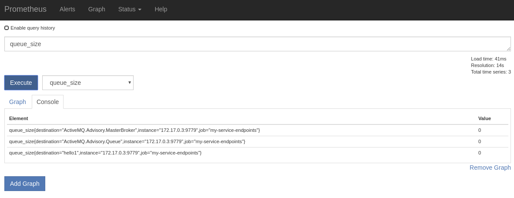
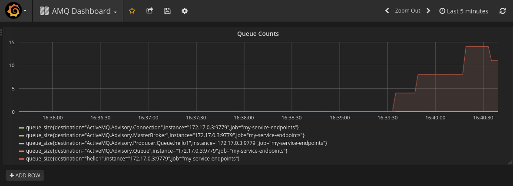

# amq63-prom-sti

Simple extension to the amq63 image to add in a prometheus agent.

Sti just bundles in the jar and prometheus yml config, in `configuration/promconfig.yml`

`ACTIVEMQ_OPTS` in the openshift template dictates the javaagent and prometheus config location:

`ACTIVEMQ_OPTS=/opt/amq/lib/jmx_prometheus_javaagent-0.10.jar=9779:/opt/amq/conf/promconfig.yml`

## To Build

```
oc new-project mydemo
oc import-image jboss-amq-63 --from=registry.access.redhat.com/jboss-amq-6/amq63-openshift --confirm -n openshift
oc new-build registry.access.redhat.com/jboss-amq-6/amq63-openshift:latest~https://github.com/welshstew/amq63-prom-sti.git
oc create -f amq63-basic-prom.json
oc new-app --template=amq63-basic-prom -p MQ_QUEUES=hello1 -p IMAGE_STREAM_NAMESPACE=mydemo
```

## Template Additions

- Pod containerport 9779 is exposed
- New service exposing the prometheus endpoint 80 -> 9779
- ACTIVEMQ_OPTS added as an ENV var prepopulated with prometheus javaagent stuff


## Running

You should notice that upon running the pod that the `ACTIVEMQ_OPTS` specified are added: `-javaagent:/opt/amq/lib/jmx_prometheus_javaagent-0.10.jar=9779:/opt/amq/conf/promconfig.yml`

```
-XX:+UseParallelGC -XX:MinHeapFreeRatio=20 -XX:MaxHeapFreeRatio=40 -XX:GCTimeRatio=4 -XX:AdaptiveSizePolicyWeight=90 -XX:MaxMetaspaceSize=100m -XX:+ExitOnOutOfMemoryError
Running jboss-amq-6/amq63-openshift image, version 1.3
INFO: Loading '/opt/amq/bin/env'
INFO: Using java '/usr/lib/jvm/java-1.8.0/bin/java'
INFO: Starting in foreground, this is just for debugging purposes (stop process by pressing CTRL+C)
Java Runtime: Oracle Corporation 1.8.0_161 /usr/lib/jvm/java-1.8.0-openjdk-1.8.0.161-0.b14.el7_4.x86_64/jre
  Heap sizes: current=123904k  free=114657k  max=1817088k
    JVM args: -javaagent:/opt/amq/lib/jmx_prometheus_javaagent-0.10.jar=9779:/opt/amq/conf/promconfig.yml -XX:+UseParallelGC -XX:MinHeapFreeRatio=20 -XX:MaxHeapFreeRatio=40 -XX:GCTimeRatio=4 -XX:AdaptiveSizePolicyWeight=90 -XX:MaxMetaspaceSize=100m -XX:+ExitOnOutOfMemoryError -javaagent:/opt/jolokia/jolokia.jar=config=/opt/jolokia/etc/jolokia.properties -Djava.security.egd=file:/dev/./urandom -Djava.awt.headless=true -Djava.io.tmpdir=/opt/amq/tmp -Dactivemq.classpath=/opt/amq/conf: -Dactivemq.home=/opt/amq -Dactivemq.base=/opt/amq -Dactivemq.conf=/opt/amq/conf -Dactivemq.data=/opt/amq/data
Extensions classpath:
  [/opt/amq/lib,/opt/amq/lib/camel,/opt/amq/lib/optional,/opt/amq/lib/web,/opt/amq/lib/extra]
ACTIVEMQ_HOME: /opt/amq
```

## Verifying

ssh into the pod and curl the prometheus endpoint to confirm the statistics required are scraped.

```
[user@localhost amq63-prom-sti]$ oc rsh broker-amq-4-5kw68
sh-4.2$ curl localhost:9779
# HELP jvm_classes_loaded The number of classes that are currently loaded in the JVM
# TYPE jvm_classes_loaded gauge
...
# HELP queue_size Queue Size
# TYPE queue_size gauge
queue_size{destination="hello1",} 0.0
queue_size{destination="ActiveMQ.Advisory.Queue",} 0.0
queue_size{destination="ActiveMQ.Advisory.MasterBroker",} 0.0
...

```

## Queue Depth

This is the prometheus configuration just to pull out the QueueSize

```
rules:
  - pattern: 'org.apache.activemq<type=(\w+), brokerName=(.*?), destinationType=(\w+), destinationName=(.*?)><>QueueSize'
    name: queue_size
    help: Queue Size
    type: GAUGE
    labels:
      destination: $4
```


Should expect:

```
# HELP queue_size Queue Size
# TYPE queue_size gauge
queue_size{destination="ActiveMQ.Advisory.Connection",} 0.0
queue_size{destination="ActiveMQ.Advisory.MasterBroker",} 0.0
queue_size{destination="hello1",} 4.0
queue_size{destination="ActiveMQ.Advisory.Queue",} 0.0
queue_size{destination="ActiveMQ.Advisory.Producer.Queue.hello1",} 0.0
```

## Prometheus yaml...

broker-amq-prom service is used to collect the stats

See https://brunonetid.github.io/2017/11/27/camel-prometheus-openshift.html to build the prometheus container

```
# my global config
global:
  scrape_interval:     15s # Set the scrape interval to every 15 seconds. Default is every 1 minute.
  evaluation_interval: 15s # Evaluate rules every 15 seconds. The default is every 1 minute.
  # scrape_timeout is set to the global default (10s).

# Scraping could be configured for specific IPs, or using discovery mechanisms
scrape_configs:

  - job_name: 'my-service-endpoints'
    kubernetes_sd_configs:
    - role: endpoints

    relabel_configs:
    - source_labels: [__meta_kubernetes_service_name]
      action: keep
      regex: broker-amq-prom
    - source_labels: [__meta_kubernetes_pod_container_port_name]
      action: keep
      regex: prometheus
```


## Setting up Prometheus and Grafana

Please see https://brunonetid.github.io/2017/11/27/camel-prometheus-openshift.html for how to build the Grafana and Prometheus containers.
Please note to use the above prometheus.yml config in order to pick up the broker-amq-prom stats.

### Prometheus



### Grafana




## References

Heavily inspired by Bruno's article:
https://brunonetid.github.io/2017/11/27/camel-prometheus-openshift.html

And also useful:
https://github.com/prometheus/jmx_exporter
